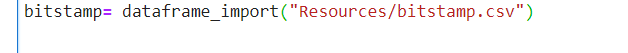

# Project Title

The Crypto Arbitrage check application is a python comment-line interface program.  It collects, prepares, and analyzes the Crypto currency data to identify the profitable crypto arbitrage opportunities.  The application imports two crypto trade data from csv, prepares the data, and produces (i)stats, (ii) crypto currency line charts, (iii) positive profitable spread, (iv) total potential profits for different periods.  The user can anlyze the application output data and charts and make recommendation on profitable crypto arbitrage trades.

---

## Technologies

This project leverages python 3.7 with the following packages:

* [Jupyter Notebook](https://jupyter-notebook-beginner-guide.readthedocs.io/en/latest/what_is_jupyter.html) - It's a server-client application that allows editing and running notebook documents via a web browser.

* [sys](https://docs.python.org/3/library/sys.html) - For exit the program function exist.

* [csv](https://docs.python.org/3/library/csv.html) - For import csv file import and export

* [pathlib](https://docs.python.org/3/library/pathlib.html) -For object-oriented filesystem paths 

* [%matplotlib inline](https://pythonguides.com/what-is-matplotlib-inline/#:~:text=What%20is%20matplotlib%20inline%20in%20python%20IPython%20provides,two%20types%20of%20magic%20functions%2C%20line-oriented%20and%20cell-oriented.) - For Cell-oriented magic functions

* [pandas](https://pandas.pydata.org/pandas-docs/stable/index.html) - For Series, DataFrame, and plots

---


## Installation Guide

Before running the application first install the following dependencies.

```python
  pip install pandas
  pip install jupyterlab
```

---

## Usage

To use the loan qualifier app, simply clone the `arbitrage_check' from the respository, open jupyter lab and open **crypto_arbitrage.ipynb** with:

```python
jupyter lab
```
Upon launching the crypto_arbitrage in jupyter notebook, you will have cell to input the source of crypto data csv and then re-run the jupyter book to produce stats and plots for the crypto data.

Enter the csv file path


Rerun the jupyterbook to receive data anlysis output


---

## Contributors

Brought to you by FinTech Material and Eunice

---

## License

MIT